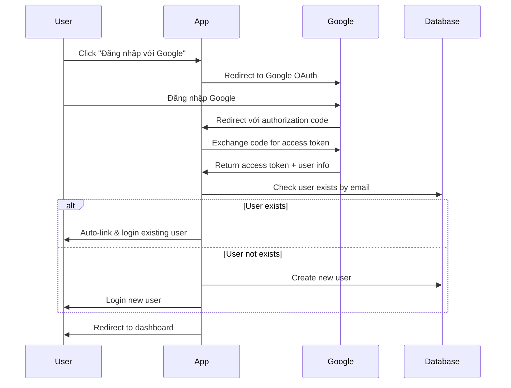

# 🔐 Hướng dẫn cấu hình Google OAuth2

## 📋 Các bước thiết lập Google OAuth2

### 1. Tạo Google Cloud Project
1. Truy cập [Google Cloud Console](https://console.cloud.google.com/)
2. Tạo project mới hoặc chọn project hiện có
3. Đảm bảo project được selected

### 2. Bật Google+ API (deprecated) hoặc Google Identity Services
1. Đi đến **APIs & Services** > **Library**
2. Tìm kiếm "Google+ API" hoặc "Google Identity Services"
3. Click **Enable**

### 3. Tạo OAuth2 Credentials
1. Đi đến **APIs & Services** > **Credentials**
2. Click **Create Credentials** > **OAuth 2.0 Client IDs**
3. Chọn **Web application**
4. Đặt tên: `English Vocab App`

### 4. Cấu hình Authorized URLs
**Authorized JavaScript origins:**
```
http://localhost:8080
```

**Authorized redirect URIs:**
```
http://localhost:8080/login/oauth2/code/google
```

### 5. Lấy Client ID và Client Secret
Sau khi tạo, copy:
- **Client ID**: `xxxx.apps.googleusercontent.com`
- **Client Secret**: `GOCSPX-xxxx`

## ⚙️ Cấu hình Environment Variables

### Cách 1: Environment Variables (Khuyến nghị)
```bash
# Windows
set GOOGLE_CLIENT_ID=your-actual-client-id
set GOOGLE_CLIENT_SECRET=your-actual-client-secret

# Linux/Mac
export GOOGLE_CLIENT_ID=your-actual-client-id
export GOOGLE_CLIENT_SECRET=your-actual-client-secret
```

### Cách 2: Cập nhật application.yml trực tiếp (Development only)
```yaml
spring:
  security:
    oauth2:
      client:
        registration:
          google:
            client-id: your-actual-client-id-here
            client-secret: your-actual-client-secret-here
```

## 🧪 Test OAuth2 Flow

1. Chạy ứng dụng: `mvn spring-boot:run`
2. Truy cập: http://localhost:8080/auth/login
3. Click button **"Đăng nhập với Google"**
4. Đăng nhập Google account
5. Kiểm tra redirect về dashboard

## 🔍 Troubleshooting

### Lỗi: "Error 400: redirect_uri_mismatch"
**Nguyên nhân**: Redirect URI không match
**Giải pháp**: Kiểm tra lại Authorized redirect URIs trong Google Console

### Lỗi: "Error 401: invalid_client"  
**Nguyên nhân**: Client ID hoặc Secret sai
**Giải pháp**: Kiểm tra lại credentials trong environment variables

### Lỗi: "Access blocked"
**Nguyên nhân**: App chưa verified bởi Google
**Giải pháp**: Trong development, click "Advanced" > "Go to English Vocab App (unsafe)"

## 📝 OAuth2 Flow trong Ứng dụng



## ✅ Checklist hoàn thành

- [ ] Google Cloud Project created
- [ ] OAuth2 credentials configured  
- [ ] Environment variables set
- [ ] Authorized URLs configured correctly
- [ ] Test Google login flow
- [ ] Verify auto-link existing users
- [ ] Verify new user creation

## 🎯 Kết quả mong đợi

✅ **2 cách đăng nhập**: Form + Google OAuth2  
✅ **Auto-link users** với cùng email  
✅ **Google users** có `password = null`  
✅ **Role USER** mặc định cho Google users  
✅ **UI đẹp** với Google branding  
